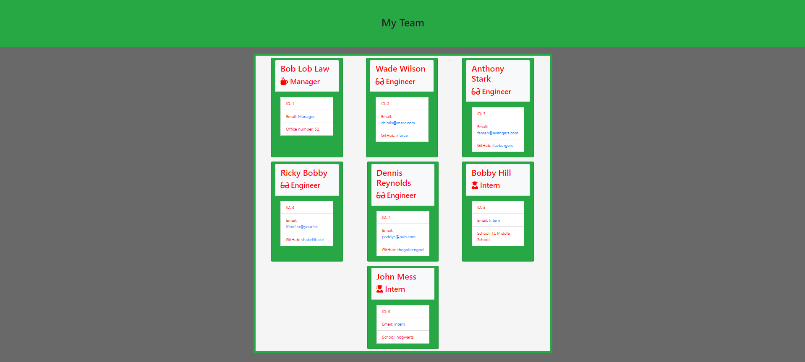

# Template Engine Team Summary

### GitHub Username: [antonio36alv](https://github.com/antonio36alv)

[GitHub Repo](https://github.com/antonio36alv/template-engine-employee-summary)

[Video Demo](https://drive.google.com/file/d/1TScdMxZJw99_8Zfz4CFWQN6yRTsvSIFl/view)

## Project Description
The purpose of this project was to generate a team summary webpage, through NodeJS CLI via inquirer. The user/manager is prompted for their details. After they are done with their own details
they have the chance to enter details for an employee, starting with that employee's role within the company, name, email, and then based on whether or not they are an engineer or intern the last question
deviates from the basic questions. I was given a JS file that renders the HTML after the details are fed in. All employees inherit from an Employee superclass.

## Table of Contents
[Installion](#installion)

[Usage](#usage)

[Tests](#tests)

## Installion
Requires : NodeJS and the inqurier package.

## Usage
If you needed a quick summarization of your team that consists of engineers, interns, and yourself/a manager this is perfect for you!

## Tests
Tests were pre-written and given to me. They ensure that the class were built correctly. You can find them within test directory. Run them with the "npm run test" CLI command.

## Future Deployments
Ability to set different kinds of roles and then being able to pick from those roles.
